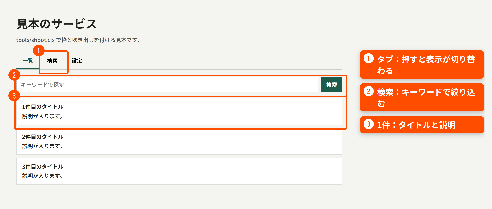
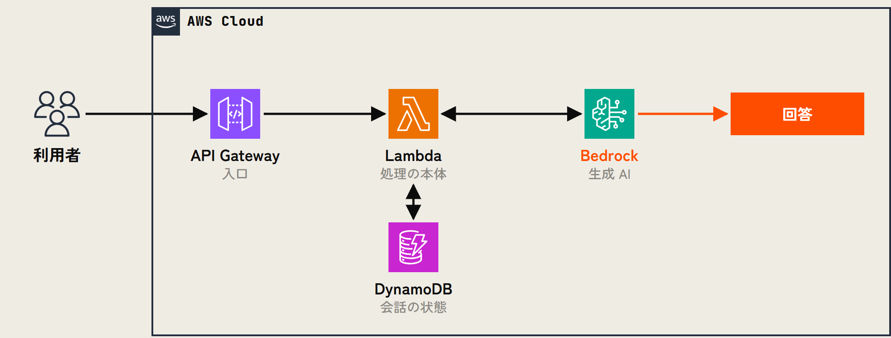

<!--
このファイルは部品の見本です。新しいデッキを作るときは、必要なスライドだけ残して書き換えてください。
- header の <i> の数 = トラックの数（最大10）
- 各スライドの _class に t1〜t10 を付けると、上部のバーと「TRACK 0N」が切り替わる
-->

<!-- _class: cover -->
<!-- _header: '' -->
<!-- _paginate: false -->

REC

# タイトルは ここに大きく 3行で.

@your-idMADE WITH <b>CLAUDE CODE</b>

<!--
【ノート】表紙。h1 の中で .o（白抜き）・.hot（差し色）・.dot（末尾の記号）が使える。
-->

---

<!-- _header: '' -->

### Tracklist

01トラックの扉は問いかけで始める？

02AとBどっちが速い？

03米国の事例は日本でも使える？

<!--
【ノート】目次。持ち時間の配分はここのノートに書いておく。各トラックの扉の問いは、ここの行と同じ文にする（npm run check で確かめる）。
-->

---

<!-- _class: t1 dark eye -->

01

### Subtitle In English

トラックの扉は 問いかけで始める？

&gt; 入力中のプロンプト

?

<!--
【ノート】扉（dark eye）。.num が右下に巨大な番号として出る。
-->

---

<!-- _class: t1 -->

01

結論を大きく言う。 差し色で強調する。

見出し.r.hl は見出しが差し色になる

見出し説明は1行に収める

見出し3行くらいがちょうどいい

「引用文はここに」── 発言者

---

<!-- _class: t1 dense -->

01

## 詳細スライドの見出しは1文で言い切る

見出し直下の要約（.lead）。<em>em は差し色</em>になる。

<b>左の列</b>

- 箇条書きのマーカーは差し色
- <b>太字</b>は 900 ウェイト
- `code` は枠付き

<b>右の列</b>

- .cols は 1:1、.cols-73 / .cols-37 で比率を変える
- 本文の文字サイズは 18px 以上にそろえる

.note は小さい灰色の注記

出典：<a href="https://marpit.marp.app/">https://marpit.marp.app/</a>

<b>用語</b>：聞き慣れない言葉の補足は .gloss で下にまとめる

---

<!-- _class: t1 dense -->

01

## 数字タイルと番号つきの理由

669<small>行</small>

強調したい数字 補足は2行まで

15<small>件</small>

ラベル

7<small>本</small>

ラベル

19<small>件</small>

ラベル

<b class="t"><i>01</i>一番言いたい理由</b>.rs.key は上の線が差し色になる

<b class="t"><i>02</i>理由の見出し</b>説明は2行くらいまで

<b class="t"><i>03</i>理由の見出し</b>2列で並ぶ

<b class="t"><i>04</i>理由の見出し</b>4つか6つがきれいに並ぶ

---

<!-- _class: t2 dark eye -->

02

### Versus

AとB どっちが速い？

Tool A?

Tool B?

同じ条件でスタート

---

<!-- _class: t2 dense -->

02

## 横棒グラフと BEFORE / AFTER

BEFORE0<small>件</small>変える前の説明

AFTER100<small>件</small>変えた後の説明

グラフのタイトル（.caption）

灰色（.hb.n）0

通常51

通常48

強調（.hb.q）100

Tool A2<small>時間</small>

Tool B30<small>分</small>

---

<!-- _class: t2 dense -->

02

## 表は Markdown のまま書ける

| 項目 | 何が困るか | どうしたか |
|---|---|---|
| 1列目は太字 | 説明 | .hot で差し色 |
| 行の線は細く | 説明 | 対応 |
| 見出し行は等幅 | 説明 | 対応 |

従来入力→処理A→処理B→出力

今回入力→1つにまとめた処理→出力

---

<!-- _class: t2 dense -->

02

## 手順・押した一言の流れ

1<b>手順の見出し</b>説明

2<b>手順の見出し</b>説明

3<b>強調する手順</b>.st.hot で差し色

「人が言った一言」それでどう変わったか

「次の一言」それでどう変わったか

---

<!-- _class: t3 dark -->

03

## チャットのやり取り

ME自分の発言は右・差し色

AIAIの発言は左・黒地

<b>注</b>：やり取りは要約・デフォルメしている

---

<!-- _class: t3 dense -->

03

## コードと番号つきの説明

---①
theme: talk2026
---
&lt;!-- コメントは灰色 --&gt;②

①<b>説明</b>　コードの番号と対応させる

②<b>説明</b>　<code>.k</code> は差し色、<code>.c</code> は灰色

間違いの種類何がどう違ったか

間違いの種類何がどう違ったか

BETA<b>告知の帯。</b>リンクを添えられる <a href="https://example.com/">https://example.com/</a>

---

<!-- _class: t3 dense -->

03

## 未記入の箇所は点線枠で残す

DEMO VIDEO

本文中の空欄：あとで書く

ブロックの空欄（.fill.fill-lg）

---

<!-- _class: t3 dense -->

03

## 画面の説明は、キャプチャに枠と吹き出しを付けて1枚で見せる

<!--
【ノート】画面は npm run shots で撮る（設定は shots.config.cjs）。小さいキャプチャを何枚も並べず、1枚を大きく載せる。
-->

---

<!-- _class: t3 dense -->

03

## 構成図は AWS の公式アイコンで HTML から書き出す

<b>作り方</b>：assets/diagrams/sample-arch.html を書き換えて npm run diagrams。アイコンは npm run icons -- AmazonBedrock で取る

---

<!-- _class: t3 dense list -->

03

## 一覧の表と、あとで扱う項目を指す吹き出し

比べ方：① 同じものを作る② 要素を応用する

| # | タイトル | 種類 | Lv |
|---|---|---|---|
| 1 | <a href="https://marp.app/">一覧の1件目（押すとリンク先が開く）</a> | ブログ | L200 |
| 2 | <a href="https://marp.app/">一覧の2件目</a> | GitHub | L300 |
| 3 | <a href="https://marp.app/">あとで詳しく扱う項目</a> | ブログ | L300 |

#3 は、このあと TRACK 04 で詳しく紹介します

凡例の色見本（.sw）は図の色に合わせる

---

<!-- _class: t3 dark eye -->

03

### Question Pair

米国の事例は 日本でも使える？

<b>米国</b>事例で何をしているか

→

<b>日本では？</b>同じことができるか

---

<!-- _class: cover -->
<!-- _header: '' -->
<!-- _paginate: false -->

END

# 締めの 問いかけも 3行で?

GitHub <b>your-id</b>この資料は <b>CLAUDE CODE</b> が作りました

